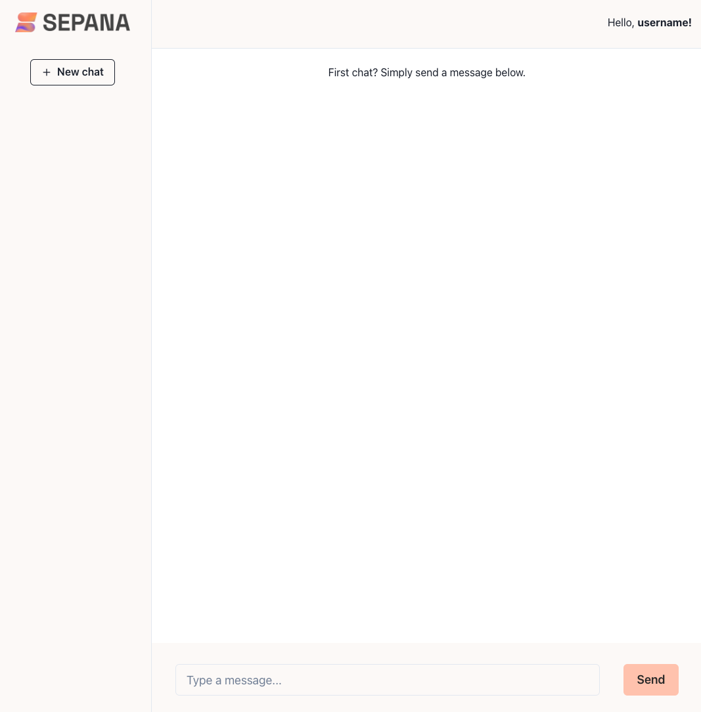
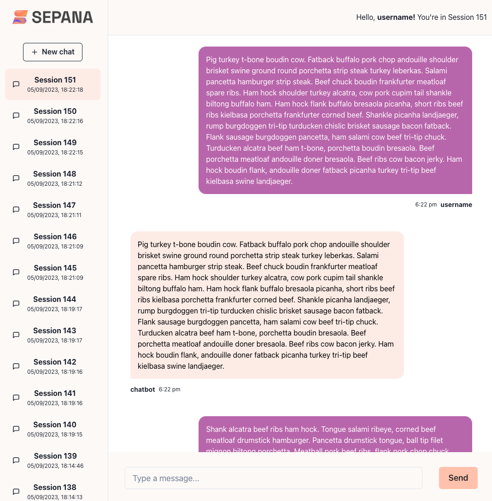

# Chatbot Frontend

This project was bootstrapped with [Create React App](https://github.com/facebook/create-react-app).

## To Setup the Frontend

In the project directory, `chatapp-frontend`, first run the following command to install all the dependencies listed within `package.json` in the local node_modules folder:

```
yarn install
```

Next in the project directory, you can run the following command to spin up the frontend:

```
yarn start
```

This runs the app in the development mode.\
Open [http://localhost:3000](http://localhost:3000) to view it in the browser.

The page will reload if you make edits.\
You will also see any lint errors in the console.

## Initial Screen

If the server is up and running you should be greated with the following screen. Prompting the user, named `username` (hardcoded), to enter their first message to the chatbot.

For more information about the initial state of the user, sessions, and messages and all other topics concerning the data pleae see the [backend README file](../chatapp/README.md)



## Sessions & Messages Screen

After interacting with the chatbot in multiple sessions the UI should look something like the image below.


